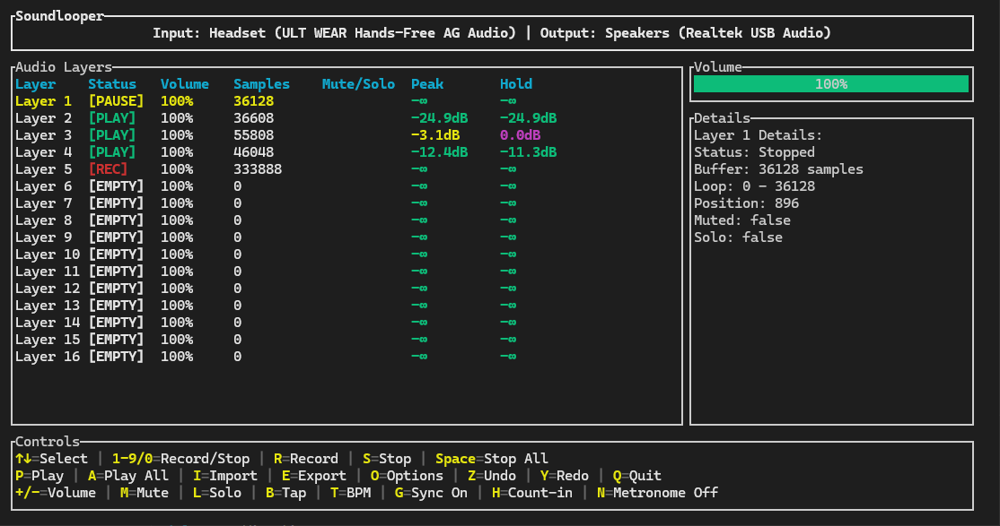

# Soundlooper

A real-time multi-layer audio looper built in Rust with a terminal UI. Record, mix, and loop up to 16 audio tracks with per-layer controls, WAV import/export, and low-latency playback. Cross-platform support for Windows, macOS, and Linux.



## Features

- **Multi-layer Recording**: Record up to 16 simultaneous audio layers
- **Real-time Playback**: Low-latency audio processing with looping
- **Per-layer Controls**: Individual volume, mute, and solo controls
- **WAV Import/Export**: Import WAV files into layers and export compositions
- **Terminal UI**: Clean, responsive TUI with device information display
- **Cross-platform**: Works on Windows, macOS, and Linux
- **Debug Mode**: Optional debug logging with `--debug` flag

## Quick Start

```bash
# Clone and build
git clone https://github.com/Cod-e-Codes/soundlooper.git
cd soundlooper
cargo build --release

# Run the application
cargo run --release

# Show help
cargo run --release -- --help

# Run with debug logging
cargo run --release -- --debug
```

## Controls

| Key | Action |
|-----|--------|
| `↑↓` | Select layer |
| `1-9`, `0` | Record/Stop/Play layer 1-10 |
| `R` | Record on selected layer |
| `S` | Stop selected layer |
| `Space` | Stop all layers |
| `P` | Play selected layer |
| `A` | Play all layers |
| `+/-` | Adjust volume |
| `M` | Mute/unmute selected layer |
| `L` | Solo/unsolo selected layer |
| `C` | Clear selected layer |
| `X` | Clear all layers |
| `I` | Import WAV file to selected layer |
| `E` | Export composition as WAV |
| `Q` | Quit |

## Architecture

The application is built with a modular architecture:

- **Audio Engine** (`src/audio/`): Core audio processing, mixing, and layer management
- **Terminal UI** (`src/ui/`): User interface built with ratatui
- **Cross-platform Audio**: Uses CPAL for audio I/O across platforms

### Key Components

- `AudioLayer`: Individual audio layer with recording, playback, and control capabilities
- `LooperEngine`: Manages all layers and handles real-time mixing
- `AudioStream`: CPAL-based audio input/output handling with resampling
- `TerminalUI`: Terminal-based user interface

## Examples

```rust
use soundlooper::audio::{AudioConfig, LooperEngine, LayerCommand};

// Create a looper engine
let config = AudioConfig::default();
let looper = LooperEngine::new(config);

// Record on layer 0
looper.send_command(LayerCommand::Record(0))?;

// Stop recording (automatically starts playback if there's content)
looper.send_command(LayerCommand::StopRecording(0))?;

// Start playback manually
looper.send_command(LayerCommand::Play(0))?;

// Stop playback
looper.send_command(LayerCommand::StopPlaying(0))?;

// Stop all layers
looper.send_command(LayerCommand::StopAll)?;

// Clear the layer
looper.send_command(LayerCommand::Clear(0))?;
```

Run the complete example:
```bash
cargo run --example simple_loop
```

## Dependencies

- `cpal` - Cross-platform audio I/O
- `hound` - WAV file reading/writing
- `rubato` - Sample rate conversion
- `ratatui` - Terminal UI framework
- `crossbeam` - Thread-safe communication
- `anyhow` - Error handling
- `crossterm` - Terminal control
- `ringbuf` - Lock-free ring buffer
- `serde` - Serialization framework
- `toml` - TOML configuration parsing

## Building

```bash
# Debug build
cargo build

# Release build
cargo build --release

# Run tests
cargo test

# Run examples
cargo run --example simple_loop
```

## Requirements

- Rust 1.70+
- Audio input/output device
- Terminal with UTF-8 support

## Contributing

Contributions are welcome! Please feel free to submit issues and pull requests.

## License

This project is licensed under the MIT License.